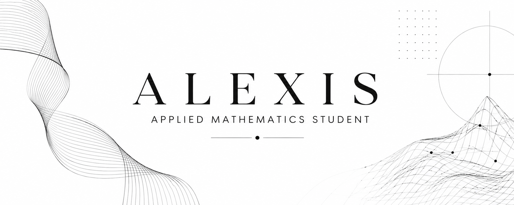

<h1 align="center">Hi, I'm Alexis 👋</h1>

Applied Mathematics Student at UNAM  
Exploring Data Analysis, Predictive Modeling and Machine Learning

---

## About Me

- 🎓 Applied Mathematics student at UNAM
- 📊 Interested in Data Analysis and Statistics
-  Aspiring Machine Learning Specialist
- 📚 Currently learning predictive modeling and statistical learning

## Languages & Tools

## Current Focus

- Machine Learning
- Statistical Learning
- Predictive Analytics
- Data Science
